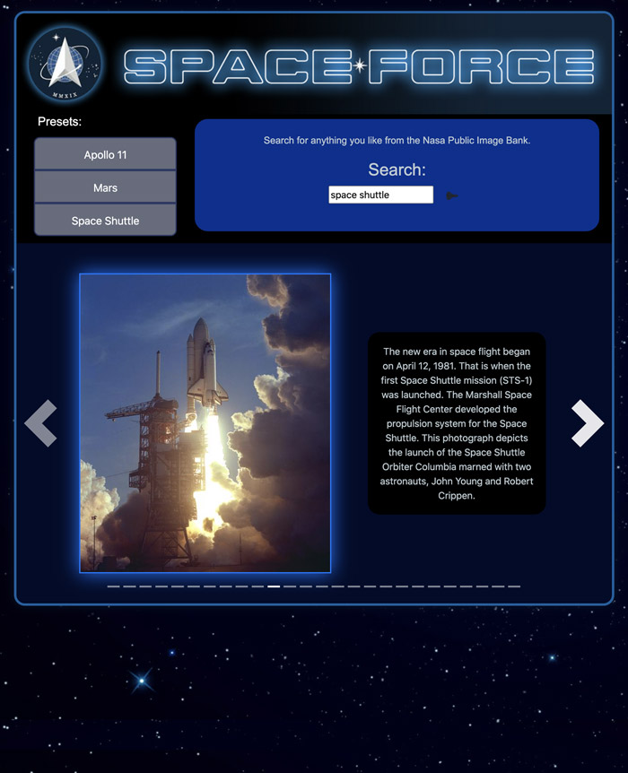

# SPACEFORCE
This app allows users to search through the publicly available NASA image bank, in an interface that is simpler and more engaging than Nasa's.



# Table of contents
1. [Live Demo](#Live_Demo)
2. [Features](#Features)
3. [Technologies](#Technologies)
4. [Contributors](#Contributors)

<a name="Live Demo"></a>
<a href="https://b0rgbart3.github.io/SpaceForce/">SpaceForce Live on GithubPates</a>

<a name="Features"></a>
## Features
- enter a search word or phrase, get a group of images as a result
- interactively scroll through the image results and read a description of each image

<a name="Technologies"></a>
## Technologies
- Javascipt
- JQuery CDN Library
- Bootstrap CDN Library


<a name="Contributors"></a>
## Contributors
- Hannah Smith
- Bart Dority
- Donna Nguyen

<a name="User_Story"></a>
## User Story
```sh
As a student or space enthusiast, I want to be able to search through NASA's publicly available image bank to learn about space and NASA's missions.
```


**on github:** <a href='github.com/b0rgBart3'>b0rgBart3</a>

[](https://github.com/remarkablemark)

Email: borgBart3@gmail.com

